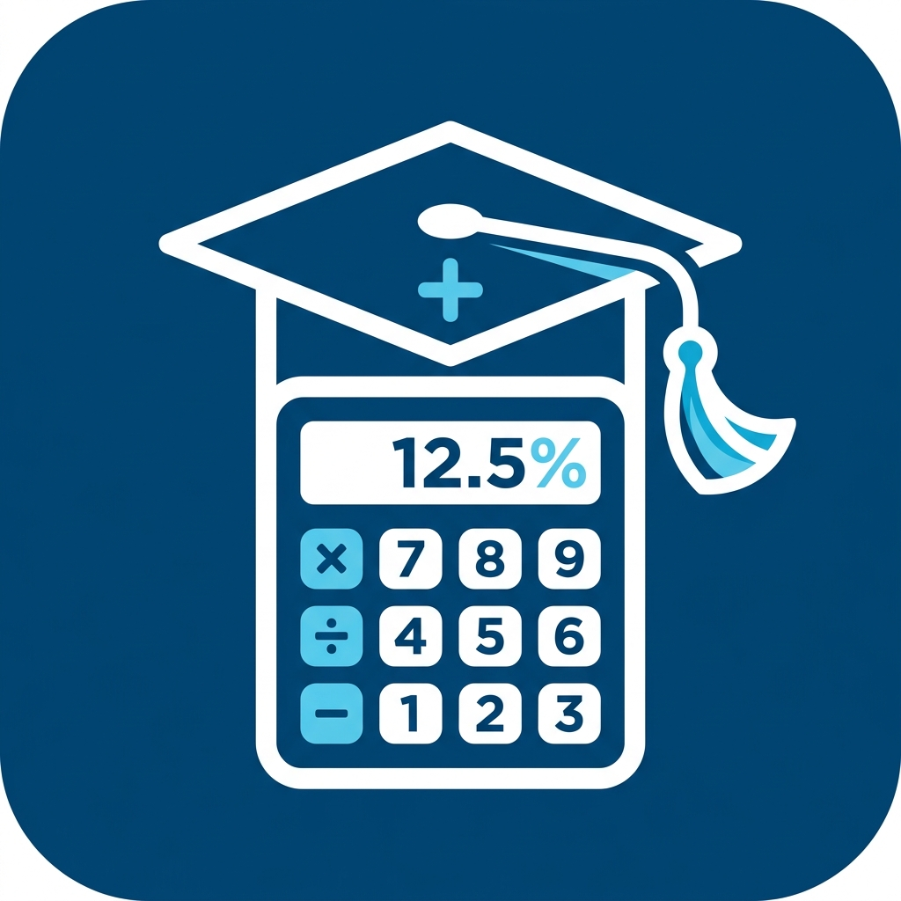

# ACT GPA Calculator

<p align="center">
  
</p>

<p align="center">
  <b>A comprehensive GPA calculator built specifically for American College of Technology (ACT) Computer Science students</b>
</p>

<p align="center">
  <a href="#features">Features</a> •
  <a href="#download">Download</a> •
  <a href="#installation">Installation</a> •
  <a href="#usage">Usage</a> •
  <a href="#grade-scale">Grade Scale</a> •
  <a href="#building">Building</a>
</p>

---

## Features

### 📊 Three Calculators in One App
- **Semester GPA Calculator** — Calculate GPA for individual semesters with all 8 ACT CS semesters pre-loaded
- **CGPA Calculator** — Track cumulative GPA across all semesters with visual analytics
- **Target GPA Planner** — Determine what GPA you need in remaining semesters to hit your graduation goal

### 📚 Complete ACT CS Curriculum
- All **8 semesters** pre-loaded with official ACT Computer Science courses
- **53 courses** in the master catalog
- Default credit hours for every course
- Support for adding custom courses

### 🎨 Modern UI
- Clean, professional interface with dark/light theme support
- Real-time calculation updates
- Visual progress indicators and GPA trend charts
- Course cards with grade badges

### 📄 Smart Features
- **Transcript Scanner** — Import grades from PDF/image using Gemini AI
- **Major Course Tracking** — Filter and calculate Major-only GPA
- **Retake Support** — Mark retaken courses to exclude them from calculations
- **Credit Hour Limit Warnings** — Alerts when exceeding 21 credits per semester

### 🏆 Academic Standing
Automatic classification:
- **President's List** — CGPA ≥ 3.80
- **Dean's List** — CGPA ≥ 3.50
- **Good Standing** — CGPA ≥ 2.00
- **Academic Probation** — CGPA < 2.00

---

## Download

### Latest APK

| Type | Download |
|------|----------|
| Debug APK | [Download](https://github.com/Samuel-Girma07/act-gpa-calculator/actions) |
| Release APK | [Download](https://github.com/Samuel-Girma07/act-gpa-calculator/actions) |

> **Note:** Click on the latest successful workflow run → Scroll to "Artifacts" → Download your preferred APK

### Requirements
- Android 7.0+ (API 24)
- ~15MB storage space

---

## Installation

### Method 1: Direct APK Install (Easiest)
1. Download the APK from the [Actions tab](https://github.com/Samuel-Girma07/act-gpa-calculator/actions)
2. On your Android device, enable **"Install from Unknown Sources"**
   - Settings → Security → Unknown Sources (or Install Unknown Apps)
3. Open the downloaded APK file and tap **Install**

### Method 2: Build from Source
```bash
# Clone the repository
git clone https://github.com/Samuel-Girma07/act-gpa-calculator.git
cd act-gpa-calculator

# Create .env file for transcript scanning (optional)
echo "GEMINI_API_KEY=your_key_here" > .env

# Build debug APK
./gradlew assembleDebug

# APK will be at: app/build/outputs/apk/debug/app-debug.apk
```

---

## Usage

### 1. Semester GPA Calculator
1. Select your semester from the dropdown (Year 1 Semester 1 through Year 4 Semester 2)
2. Enter your marks for each course (0-100 or letter grades: A+, A, A-, B+, B, etc.)
3. Toggle course inclusion if needed
4. Your GPA updates automatically in real-time

### 2. CGPA Calculator
1. Switch to the **CGPA** tab
2. Toggle which semesters to include
3. Enter GPA manually or use computed values
4. See your cumulative GPA, major GPA, and academic standing

### 3. Target GPA Planner
1. Switch to the **Target** tab
2. Enter your current CGPA and completed credits
3. Set your target CGPA and remaining credits
4. See what GPA you need to achieve your goal

### 4. Transcript Scanning (Optional)
1. Tap **"Import Transcript"** on the GPA screen
2. Select a PDF or image of your transcript
3. The app uses Gemini AI to extract course names, credits, and grades

---

## Grade Scale

ACT uses the following grading system:

| Mark Range | Grade | Grade Point |
|------------|-------|-------------|
| 90-100 | A+ | 4.00 |
| 85-89 | A | 4.00 |
| 80-84 | A- | 3.75 |
| 75-79 | B+ | 3.50 |
| 70-74 | B | 3.00 |
| 65-69 | B- | 2.75 |
| 60-64 | C+ | 2.50 |
| 55-59 | C | 2.00 |
| 50-54 | C- | 1.75 |
| 40-49 | D | 1.00 |
| 0-39 | F | 0.00 |

---

## Pre-loaded Semesters

### Year 1 — Semester 1
- Communicative English I (3cr)
- Geography of Ethiopia and the Horn (3cr)
- Critical Thinking (3cr)
- Mathematics for Natural Sciences (3cr)
- General Physics (3cr)
- General Psychology (3cr)
- Physical Fitness (2cr)

### Year 1 — Semester 2
- Communicative English II (3cr)
- Social Anthropology (2cr)
- Economics (3cr)
- Applied Mathematics I (3cr)
- History of Ethiopia and the Horn (3cr)
- Emerging Technologies (3cr)
- Moral and Civic Education (2cr)
- Global Trends (2cr)

### Year 2 — Semester 1
- Computer Programming (4cr)
- Fundamentals of Database Systems (3cr)
- Digital Logic Design (3cr)
- Linear Algebra (3cr)
- Probability and Statistics (3cr)
- Inclusiveness (2cr)

### Year 2 — Semester 2
- Computer Organization and Architecture (3cr)
- Data Communication and Computer Networks (3cr)
- Advanced Database Systems (3cr)
- Java Programming (3cr)
- Discrete Mathematics and Combinatorics (3cr)
- Numerical Analysis (3cr)

### Year 3 — Semester 1
- Object Oriented Programming (3cr)
- Data Structures and Algorithms (3cr)
- Operating Systems (3cr)
- Microprocessor and Assembly Language (3cr)
- Software Engineering (3cr)
- Web Programming I (3cr)
- Automata and Complexity Theory (3cr)

### Year 3 — Semester 2
- Real-Time and Embedded Systems (3cr)
- Wireless and Mobile Computing (3cr)
- Computer Graphics (3cr)
- Web Programming II (3cr)
- Design and Analysis of Algorithms (3cr)
- Industrial Practice (2cr)
- Entrepreneurship and Business Development (3cr)

### Year 4 — Semester 1
- Introduction to Artificial Intelligence (3cr)
- Computer Security (3cr)
- Compiler Design (3cr)
- Computer Vision and Image Processing (3cr)
- Research Methods (2cr)
- Final Year Project I (3cr)
- Web Technologies (3cr)

### Year 4 — Semester 2
- Network and System Administration (3cr)
- Distributed Systems (3cr)
- Final Year Project II (3cr)
- Selected Topics in Computer Science (3cr)
- Elective (3cr)

---

## Building

### Prerequisites
- Android Studio Hedgehog (2023.1.1) or newer
- JDK 17
- Android SDK 24+

### Build Steps
```bash
# Clone repository
git clone https://github.com/Samuel-Girma07/act-gpa-calculator.git
cd act-gpa-calculator

# Optional: Set up Gemini API key for transcript scanning
cp .env.example .env
# Edit .env and add: GEMINI_API_KEY=your_key_here

# Build debug APK
./gradlew assembleDebug

# Build release APK
./gradlew assembleRelease
```

---

## Tech Stack

- **Language:** Kotlin
- **UI:** Jetpack Compose
- **Architecture:** MVVM with Repository pattern
- **Database:** Room (SQLite)
- **AI:** Google Gemini API (for transcript scanning)
- **Charts:** Vico Compose
- **Image Loading:** Coil

---

## Contributing

Contributions are welcome! Please feel free to submit a Pull Request.

1. Fork the repository
2. Create your feature branch (`git checkout -b feature/AmazingFeature`)
3. Commit your changes (`git commit -m 'Add some AmazingFeature'`)
4. Push to the branch (`git push origin feature/AmazingFeature`)
5. Open a Pull Request

---

## License

This project is open source and available under the [MIT License](LICENSE).

---

## Acknowledgments

- Built for **American College of Technology (ACT)** Computer Science students
- Grade scale based on ACT's official grading policy
- Icons and design inspired by Material Design 3

---

<p align="center">
  Made with ❤️ for ACT CS Students
</p>
